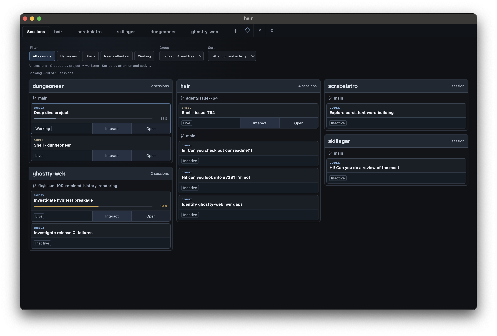
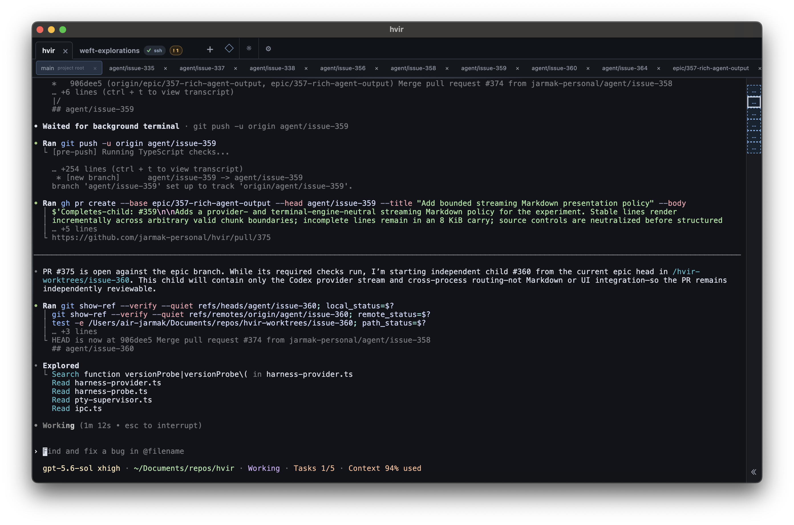
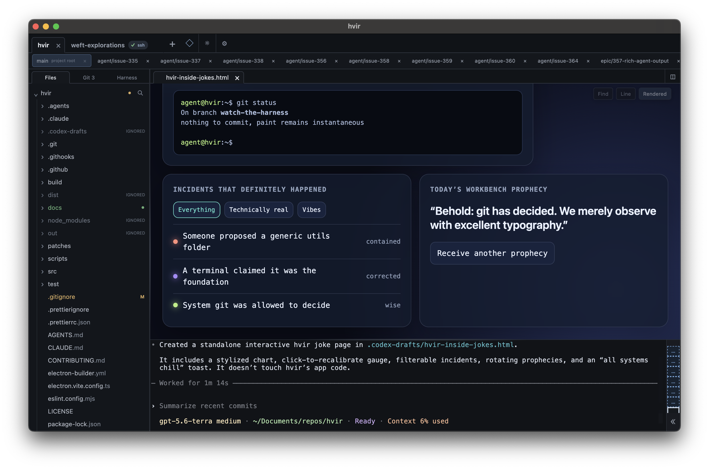

# hvir (H-veer)

**h**arness · **v**iew · **i**nteract · **r**espond

**For those who like to stay in the loop.**

hvir is a lightweight code and Git explorer wrapped around the terminals where
Claude Code, Codex, and your shell do the work. Follow your sessions, explore the
codebase, and review what your agents changed, all in one window.


## Why hvir?

Hand work to your agents, then read the code, inspect their changes, and respond when
they need you. hvir is built around viewing and reviewing, with your terminals always
close at hand.

- **Review what changed.** Explore working-tree and branch-point diffs, blame, history,
  and the commit graph.
- **Read what your agents produce.** View source, rendered Markdown, and interactive
  HTML beside the terminal that produced it.
- **Keep up with your sessions.** See which agents need attention, split terminals,
  and resume your Claude Code and Codex conversations when you return.
- **Work across projects.** Open local and SSH projects, with Git worktrees
  automatically discovered as workspaces.

## Sessions across every workspace

Sessions brings together the agents and shells you've opened in hvir across projects
and worktrees. See what's working and what needs you, choose **Interact** to jump into
a live terminal, then return to its workspace to explore the code.

[](docs/screenshots/sessions-overview.png)

## Install

Install hvir from its latest GitHub Release, then launch it from any directory:

```sh
curl -fsSL https://github.com/jarmak-personal/hvir/releases/latest/download/install.sh | bash
hvir .
```

The installer selects and verifies the release's native package for Linux x64, Linux arm64,
or Apple-silicon macOS before invoking the platform installation step.

Want to manage the installation yourself? [Follow these steps.](docs/manual-installation.md)

hvir does expect the system `git` binary. Claude Code and Codex launch options use those CLIs
from the selected host's login-shell environment; plain shells work without either.

## One window, many views

Give the terminal room while an agent works, then open a diff, read a document, or
explore an HTML page it created. Split viewers and terminals to keep related work
side by side.

| | |
| --- | --- |
| **Rendered documentation** | **Branch-point diff** |
| [](docs/screenshots/rendered-markdown.png) | [](docs/screenshots/branch-point-diff.png) |
| [](docs/screenshots/terminal-focus.png) | [](docs/screenshots/live-html-viewer.png) |
| **Terminal focus** | **Live HTML beside the harness** |

## Feedback and contributions

Found a bug, have an idea, or want to share how you use hvir? Start in
[GitHub Discussions](https://github.com/jarmak-personal/hvir/discussions).

Public contributions happen through discussion. Maintainers author issues and own
implementation; outside issues and pull requests aren't accepted. See the
[contributor guide](CONTRIBUTING.md) for the contribution model and workflow.

## Development

To run from source, install Node 24 or newer:

```sh
npm ci
npm run dev
```

See the [contributor guide](CONTRIBUTING.md) for verification and development workflows,
and [design and architecture](docs/design.md) for the product philosophy and decisions.

## License

hvir is available under the [MIT License](LICENSE). See
[Third-party notices](THIRD_PARTY_NOTICES.md) for software redistributed with hvir,
including the locally modified terminal runtime.
