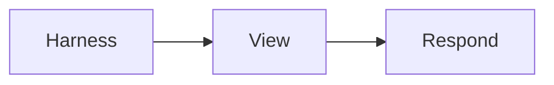

# Rendered fixture



```ts
const mode: 'rendered' | 'source' | 'diff' = 'rendered'
```

```toml
[language_catalog_fixture]
lazy = true
```

[Open the YAML fixture](rendered.yml)
[Missing target](missing.md)


Bare filenames such as design.md are prose, not internet hosts.

- [ ] Follow-up remains visible
- [x] Completed work is clearly checked
  - [ ] Nested agent task
- [~] GitLab inapplicable task
